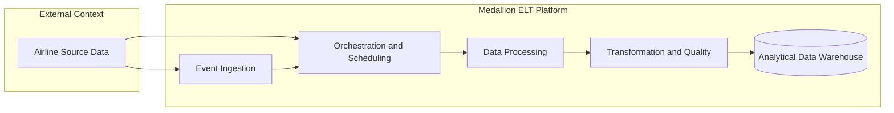

# High-Level Architecture (HLA)

This document describes the high-level architecture of the Medallion ELT platform, focusing on system boundaries, major capabilities, and core data flow.

## 1. System Context

The solution ingests airline delay CSV data and transforms it into analytics-ready datasets in PostgreSQL using a Medallion approach (Bronze, Silver, Gold).

## 2. High-Level Architecture Diagram

## 3. Core Components

1. Data Source: Mounted CSV files.
2. Orchestration: Apache Airflow DAGs for scheduled and event-triggered runs.
3. Eventing: Kafka producer and Kafka-triggered Airflow path.
4. Processing: PySpark jobs for ingestion and cleaning.
5. Transformation Layer: dbt incremental models and data tests.
6. Data Warehouse: PostgreSQL schemas bronze, silver, and gold.

## 4. High-Level Data Flow

1. Source files are detected and/or scheduled for processing.
2. Airflow orchestrates Bronze ingestion into PostgreSQL.
3. PySpark creates cleaned Silver datasets.
4. dbt builds and validates Gold aggregates.
5. Gold datasets are exposed for reporting and SQL-based analysis.