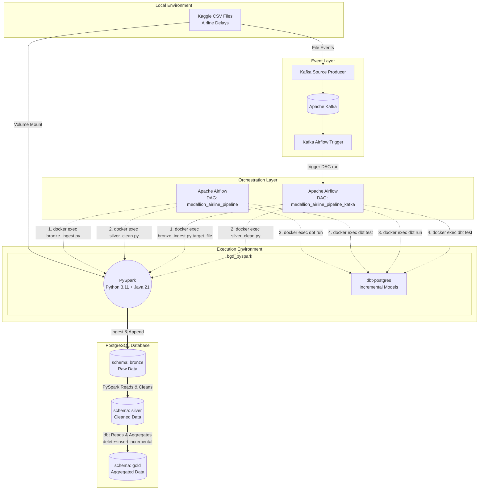

# Pipeline Architecture LLD

The pipeline extracts raw CSV data (~10 GB), processes it using Apache Spark (PySpark) within an isolated Docker container, and loads it incrementally into a PostgreSQL data warehouse. The workflow is orchestrated by Apache Airflow and additionally supports a Kafka-triggered DAG path for automatic starts.

